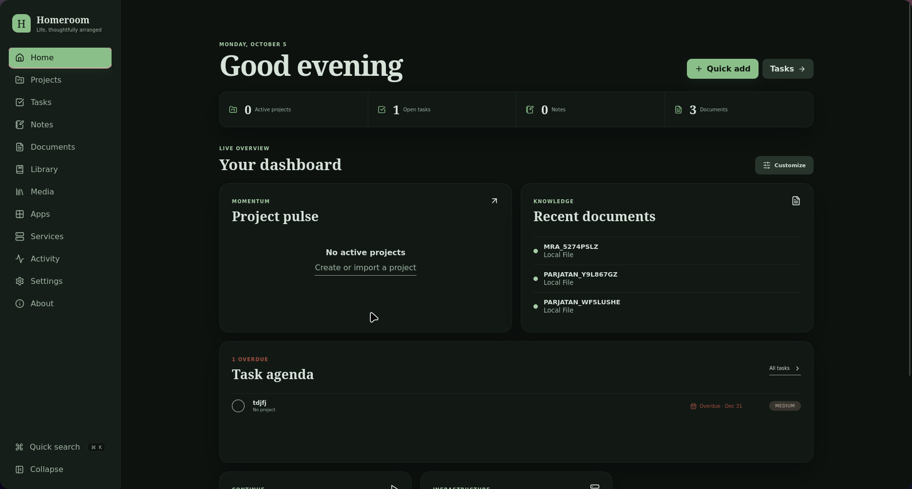
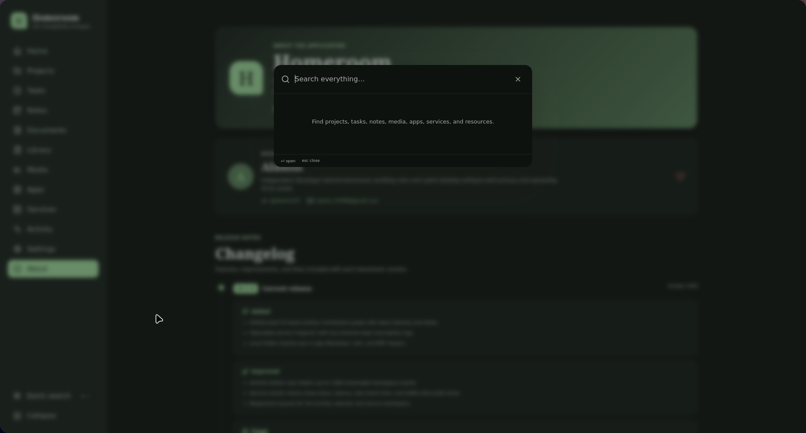
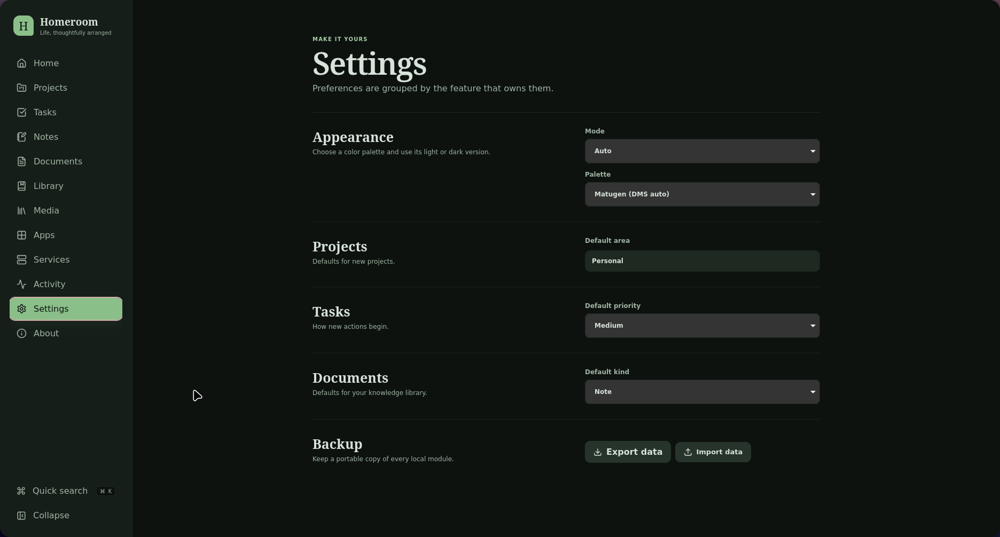

# Homeroom

Homeroom is an open-source, local-first desktop dashboard for organizing everyday work, files, media, shortcuts, and self-hosted services. It is a local server like application that gives you a home server dashboard. 



## Features

- **Home** — customizable widgets, workspace totals, task agenda, contribution activity, and quick capture.
- **Projects** — status, progress, dates, areas, tags, and full project editing.
- **Tasks** — priorities, due dates, project links, editing, open/today/completed filters, and quick completion.
- **Notes** — editable notes with pinning, colors, and tags.
- **Documents** — editable notes, references, checklists, project links, and local-folder imports.
- **Readers** — built-in Markdown, plain-text, and PDF viewing for approved local files.
- **Library** — editable categorized bookmarks and resources with favorites.
- **Media** — editable books, films, shows, games, and other media with progress and ratings.
- **Apps** — editable categorized launch shortcuts with favorites.
- **Services** — editable on-demand endpoint checks with latency, last-check status, and terminal-style probe logs.
- **Activity** — persistent workspace history and a 53-week contribution graph.
- **Global search** — `Ctrl/Cmd + K` search with contextual actions such as open, copy, complete, and favorite.
- **Appearance** — Auto, Light, and Dark modes with Homeroom, Gruvbox, Tokyo Night, Catppuccin, Nord, Solarized, and DMS/Matugen-generated palettes.
- **Settings** — feature defaults and portable backup import/export.
- **About** — app version, developer information, and categorized release notes.

## Screenshots

| Global search | Appearance and Matugen |
| --- | --- |
|  |  |

## Changelog

See [CHANGELOG.md](CHANGELOG.md) for unreleased changes and version history. The app's **About** page contains the shorter, user-facing release notes.

## Privacy

- No accounts, telemetry, analytics, advertising, or cloud sync.
- Organizer data stays in the app's local storage.
- Local-file access is limited to folders selected through the native picker.
- Network access occurs only when opening a link or manually checking a configured service URL; checks send no request body.
- Backups are exported and imported manually from **Settings**.

## Requirements

- Node.js 20+ and npm
- Rust stable toolchain
- Linux Tauri dependencies; on Fedora:

```bash
sudo dnf install webkit2gtk4.1-devel libsoup3-devel
```

## Setup

```bash
git clone https://github.com/alamin147/homeroom.git
cd homeroom
npm install
npm run tauri dev
```

Browser-only development is available with `npm run dev`. Local folders and the DMS/Matugen palette require the Tauri desktop app.

## Build and install

```bash
./build.sh
```

This builds the frontend and desktop app, then installs `homeroom` to `~/.local/bin`.

For distributable system packages, run:

```bash
./release.sh
```

The script validates the app, builds AppImage, DEB, and RPM packages, and collects them with `SHA256SUMS` under `release/v<version>/`.

For cross-platform installers, open **Actions → Release desktop installers → Run workflow** on GitHub and choose `all`, `linux`, `windows`, or `macos`. The workflow adds the selected AppImage/DEB/RPM, Windows setup `.exe`, or Intel and Apple Silicon `.dmg` files to a draft GitHub release. Review the draft before publishing it.

See [Development and release workflow](WORKFLOW.md) for the short feature-to-release checklist.

## Verify

```bash
npm run check
```

## Project layout

- `src/features/` — feature pages and UI
- `src/providers/` — local data providers
- `src/shared/` — shared models, storage, and components
- `src-tauri/` — native commands and filesystem validation
- `docs/` — architecture and extension notes

See [Architecture](docs/ARCHITECTURE.md) and [Adding a feature](docs/ADDING_A_FEATURE.md).

## License

[MIT](LICENSE) © 2026 Alamin


## Contributing
You are welcome to contribute to Homeroom! Please read the [contributing guidelines](CONTRIBUTING.md) for more information on how to get started. And send a PR. 
